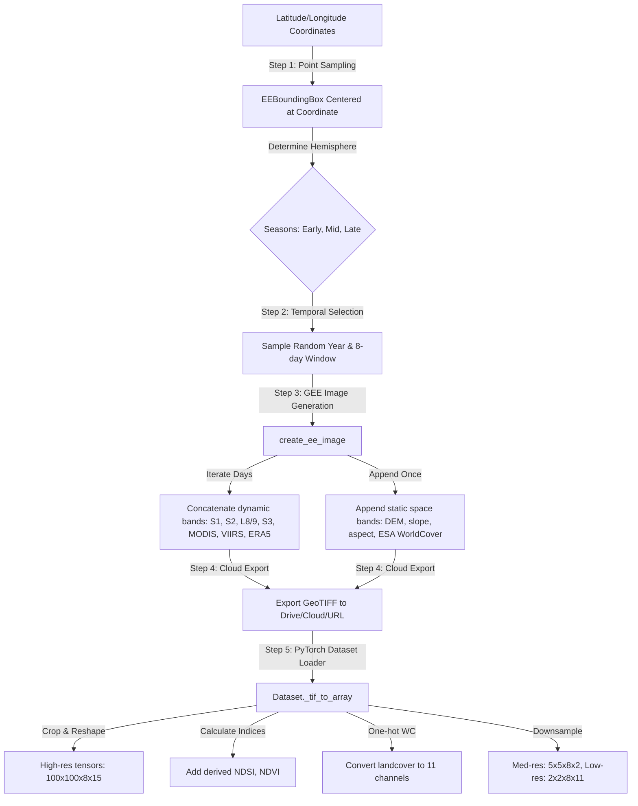
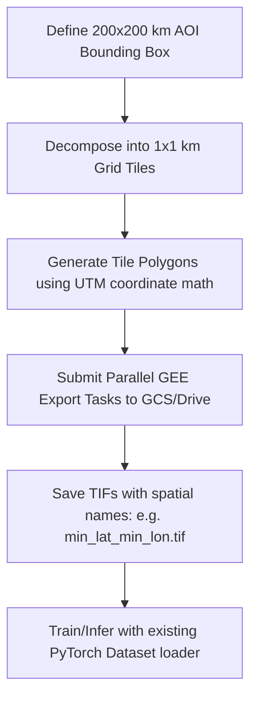
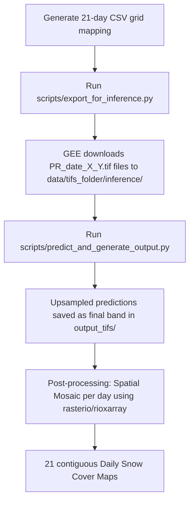

# Comprehensive GEE Dataset Analysis & Scaling Guide

*Formerly `NEW_GEE_DATASET_ANALYSIS.md`.*

This document explains in detail how the remote sensing dataset in this repository is constructed from Google Earth Engine (GEE) exports and how to scale this ingestion pipeline to cover a larger geographical region (such as a 2x2 grid of Sentinel-2 products).

______________________________________________________________________

## 1. How the Dataset is Built (End-to-End Ingestion Flow)

The dataset ingestion pipeline bridges cloud-based spatial queries in **Google Earth Engine** with a local, multi-resolution **PyTorch Dataset** loader.



### Phase 1: Coordinate Processing and Spatiotemporal Sampling

1. **Latitude/Longitude Input**:
   In `scripts/export_for_pretrain.py`, the entry point receives a tabular dataset containing `Latitude` and `Longitude` coordinate columns.
2. **Spatial Bounding Box (`EEBoundingBox`)**:
   `EarthEngineExporter.export_for_latlons` reads each row and constructs an `EEBoundingBox` centered at the point.
   - The bounding box half-width is defined as `surrounding_metres = EXPORTED_HEIGHT_WIDTH_METRES / 2` (default $500\\text{ m}$ on each side, yielding a $1\\text{ km} \\times 1\\text{ km}$ square).
   - Degree conversions are dynamically computed based on the coordinate's latitude using local Earth radius estimates:
     $$m\_{\\text{lat}} \\approx 111132.954 - 559.822\\cos(2\\phi) + 1.175\\cos(4\\phi)$$
     $$m\_{\\text{lon}} \\approx 111412.84\\cos(\\phi) - 93.5\\cos(3\\phi) + 0.118\\cos(5\\phi)$$
3. **Temporal Window Selection**:
   Depending on the coordinate's hemisphere (Northern vs. Southern), the exporter determines seasons:
   - **North Hemisphere**: `early` (`10-01` to `12-15`), `mid` (`12-16` to `02-28`), `late` (`03-01` to `06-30`).
   - **South Hemisphere**: `early` (`04-01` to `06-15`), `mid` (`06-16` to `08-28`), `late` (`09-01` to `12-30`).
     For each season, a year is sampled randomly in `[START_YEAR, END_YEAR]` (default 2022–2023) using a deterministic coordinate-based seed. A contiguous `NUM_TIMESTEPS = 8` day window is sampled from that season via `sample_time_window`.

______________________________________________________________________

### Phase 2: Earth Engine Image Aggregation (`create_ee_image`)

The exporter invokes `create_ee_image` (located in `src/data/earthengine/eo.py`) to build a single multiband image representing all dynamic and static modalities.

1. **Temporal Loop**:
   The exporter steps day-by-day (`DAYS_PER_TIMESTEP = 1`) through the 8-day window. For each day, it fetches a single representative daily image from the active modalities in `TIME_IMAGE_FUNCTIONS`:

   - **Sentinel-1 (S1)**: `[VV, VH, angle]` from `COPERNICUS/S1_GRD`
   - **Sentinel-2 (S2)**: `[B2, B3, B4, B8, B11, B12]` (RGB, NIR, SWIR) from `COPERNICUS/S2_HARMONIZED`
   - **Landsat 8/9**: `[B2..B7]_landsat` from `LANDSAT/LC08/C02/T1_L2` and `LANDSAT/LC09/C02/T1_L2`
   - **Sentinel-3 (S3)**: `[Oa17_radiance, Oa21_radiance]` from `COPERNICUS/S3/OLCI`
   - **MODIS**: `sur_refl_b01..b07` from `MODIS/061/MOD09GA`
   - **VIIRS Fine**: `[I1, I3]` (Red and NIR) from `NOAA/VIIRS/001/VNP09GA`
   - **VIIRS Coarse**: `[M5, M7, M10, M11]` from `NOAA/VIIRS/001/VNP09GA`
   - **ERA5 Weather**: `[skin_temperature, temperature_2m, total_precipitation_sum, u_component_of_wind_10m, v_component_of_wind_10m]` from `ECMWF/ERA5_LAND/DAILY_RAW`
   - **Cloud Flags**: Sentinel-2 `QA60`, MODIS cloud state, and Landsat pixel QA.

   *Missing data handling:* If a specific sensor has no coverage on a given day within the bounding box, a placeholder image filled with default values is dynamically created to keep the band counts consistent.

2. **Temporal Combination**:
   The `image_collection` containing 8 separate daily images is flattened into a single image using `combine_bands_function`:

   ```python
   imcoll = ee.ImageCollection(image_collection_list)
   img = ee.Image(imcoll.iterate(combine_bands_function))
   ```

   This yields an interleaved band structure of length $8 \\times 38 = 304$ dynamic bands:
   $$\\text{[band_1_t0, band_2_t0, ..., band_C_t0, band_1_t1, ..., band_C_t7]}$$

3. **Static Spatial Appending**:
   After the temporal bands, static terrain and landcover datasets are appended via `SPACE_IMAGE_FUNCTIONS`:

   - **Copernicus DEM**: `[DEM, slope, aspect]` derived from `COPERNICUS/DEM/GLO30`
   - **ESA WorldCover (WC)**: `Map` class labels from `ESA/WorldCover/v200`
     This completes the GEE image bands, adding 4 static channels for a total of 308 bands.

______________________________________________________________________

### Phase 3: Spatial Exporting

The completed Earth Engine image is exported using one of three modes (`cloud`, `drive`, or `url`):

- **Parameters**: `crs="EPSG:4326"`, `scale=10` (meters per pixel), `formatOptions={"noData": NO_DATA_VALUE}` (where `NO_DATA_VALUE = -9999`), and `img.unmask(-9999)`.
- **Output Dims**: Since the cell bounding box is 1 km wide and exported at a 10 m scale, the resulting GeoTIFF file has spatial dimensions of exactly $100 \\times 100$ pixels (subject to minor projection distortions at high latitudes, which convergence scripts handle gracefully).

______________________________________________________________________

### Phase 4: Local PyTorch Dataset Loading (`Dataset._tif_to_array`)

When the PyTorch `DataLoader` requests a batch, `src/data/dataset.py` reads the GeoTIFF file and performs the following structural transformations:

1. **Interleaved Band Reshaping**:
   The flat 1D band dimension of the TIFF is parsed using `rioxarray` and reshaped to extract the time axis:

   ```python
   dynamic_in_time_x = rearrange(
       values[: -(len(EE_SPACE_BANDS))],
       "(t c) h w -> h w t c",
       c=len(EO_ALL_DYNAMIC_IN_TIME_BANDS),
       t=int(num_timesteps),
   )
   ```

   This splits the dynamic layers into `(H, W, T, C)` format, where $H, W = 100$, $T = 8$, and $C = 38$.

2. **Resolution Group Partitioning**:
   The bands are separated into the resolution hierarchies expected by the model architecture:

   - **High-Res Spatial-Temporal** (`space_time_high_res_x`): Sentinel-1, Sentinel-2, Landsat. Dims: $100 \\times 100 \\times 8 \\times 15$.
   - **Medium-Res Spatial-Temporal** (`space_time_med_res_x`): Sentinel-3 bands. Dims before pooling: $100 \\times 100 \\times 8 \\times 2$.
   - **Low-Res Spatial-Temporal** (`space_time_low_res_x`): MODIS, VIIRS Fine. Dims before pooling: $100 \\times 100 \\times 8 \\times 9$.
   - **Time-only Meteorological** (`time_x`): VIIRS Coarse, ERA5 Weather. Dims before averaging: $100 \\times 100 \\times 8 \\times 9$.
   - **Static Spatial** (`space_x`): Terrain elevation/slope/aspect and ESA WorldCover. Dims: $100 \\times 100 \\times 4$.
   - **Static Coordinate** (`static_x`): Cartesian coordinates derived from geographic center:
     $$[x, y, z] = [\\cos(\\phi)\\cos(\\lambda), \\cos(\\phi)\\sin(\\lambda), \\sin(\\phi)]$$

3. **Index Computation**:

   - **NDVI** and **NDSI** are dynamically computed using the red, NIR, green, and SWIR MODIS bands. They are clamped to `(-1, 1)` and appended to the low-res spatial-temporal group (expanding it to 11 bands).

4. **Landcover One-Hot Encoding**:

   - The single-channel ESA WorldCover `Map` band is expanded into 11 one-hot channels corresponding to the primary land cover classes (`[10, 20, 30, 40, 50, 60, 70, 80, 90, 95, 100]`), expanding the static spatial group to 14 bands.

5. **Downsampling via Block Pooling**:
   Medium and low-resolution groups are downsampled to their target spatial dimensions using average pooling:

   - **Medium-Res** is average-pooled over $20 \\times 20$ pixel blocks (`h_block = H // new_H` where $H=100$, $new_H=5$) to yield **$5 \\times 5 \\times 8 \\times 2$**.
   - **Low-Res** is average-pooled over $50 \\times 50$ pixel blocks to yield **$2 \\times 2 \\times 8 \\times 11$**.
   - **Time-only Meteorological** is spatially averaged over the entire $100 \\times 100$ spatial footprint to yield **$8 \\times 9$** tokens.

6. **Mask Generation & Normalization**:

   - A logical valid-data mask (where `0` is invalid, `1` is valid) is built for each group by identifying universal no-data (`-9999`) and checking sensor-specific threshold bounds.
   - If normalization is active, a `Normalizer` uses precomputed mean/std bounds to map values to $[mean - 2\\sigma, mean + 2\\sigma]$, keeping invalid pixels at `-9999` to ensure they are ignored during masked loss computation.

______________________________________________________________________

## 2. Scaling Ingestion to a Bigger Region (e.g., a 2x2 Sentinel-2 Grid)

A single Sentinel-2 granule covers approximately $100\\text{ km} \\times 100\\text{ km}$. Therefore, a **2x2 grid** represents an Area of Interest (AOI) of approximately **$200\\text{ km} \\times 200\\text{ km}$**.

### The Scale Challenge

Exporting a $200\\text{ km} \\times 200\\text{ km}$ bounding box contiguous cube at 10-meter resolution presents major processing constraints:

- **Pixel Grid Size**: A single band would have spatial dimensions of $20,000 \\times 20,000$ pixels.
- **Multiband Data Volume**: An 8-timestep, 38-band composite would contain:
  $$20,000 \\times 20,000 \\times 8 \\times 38 = 1.216 \\times 10^{11} \\text{ values}$$
  In 16-bit half-precision, this is **over 240 GB of raw floating-point data for a single spatiotemporal window!**
- **GEE limits**: Exceeds the standard GEE single-task `maxPixels` export ceiling, causing task aborts.
- **RAM Limits**: Loading a single 240 GB raster file into local training memory will cause Out Of Memory (OOM) failures.

### Action Plan: How to Proceed

To ingest and process this data scale, you can choose from four primary scaling patterns depending on your end goal:

______________________________________________________________________

### Option A: Contiguous Grid Patching (Spatial Tiling)

*Recommended for building dense regional coverage (e.g. daily snow mosaics).*

Instead of exporting one massive file, partition the $200\\text{ km} \\times 200\\text{ km}$ AOI into a structured grid of smaller, non-overlapping tiles matching the model's expected $1\\text{ km} \\times 1\\text{ km}$ resolution footprint.



1. **Grid Generation**:
   Define the large bounding box in a local projected coordinate system (e.g., UTM zone, such as EPSG:32611 for Bow Valley) to maintain exact metric distances.
2. **Decomposition**:
   Decompose the grid into $1\\text{ km} \\times 1\\text{ km}$ tiles. Use the existing `EEBoundingBox.to_polygons(metres_per_patch=1000)` method to automatically split the master bounding box into grid rows and columns:
   ```python
   # Split a large 200 km grid into 1 km patches
   bbox = EEBoundingBox(min_lon, min_lat, max_lon, max_lat)
   polygons = bbox.to_polygons(metres_per_patch=1000)
   ```
3. **Parallel Cloud Exporting**:
   Configure the `EarthEngineExporter` in `"cloud"` mode (`dest_bucket`). Submit each grid tile as an independent Earth Engine task:
   ```python
   # Batch submission up to GEE's 3000 parallel task limit
   for idx, polygon in enumerate(polygons):
       exporter._export_for_polygon(
           polygon=polygon,
           polygon_identifier=f"tile_{idx}",
           interval_start_date=start_date,
           interval_end_date=end_date,
       )
   ```
4. **Directory Consumption**:
   Store the resulting `.tif` files in a single folder. The `Dataset` class can ingest this folder directly, since it is designed to discover and process folders of high-resolution patches independently.

______________________________________________________________________

### Option B: Sparse Grid Point Ingestion

*Recommended for model pretraining or training downstream classifiers efficiently.*

If the downstream model does not require a contiguous spatial grid sweep, avoid redundant contiguous exports by sampling representative geographic points across the 2x2 grid region.

1. **Coordinate Grid Generation**:
   Generate a sparse grid of latitude/longitude coordinates spaced at regular intervals (e.g., every 5 km or 10 km).
2. **Coordinate CSV Creation**:
   Export these points to a CSV file with columns `Latitude` and `Longitude`.
3. **Exporter Execution**:
   Run the standard ingestion pipeline:
   ```python
   import pandas as pd
   from src.data import EarthEngineExporter

   latlons = pd.read_csv("my_sparse_grid.csv")
   exporter = EarthEngineExporter(dest_bucket="my-project-bucket", mode="cloud")
   exporter.export_for_latlons(latlons)
   ```
   This will export clean $1\\text{ km} \\times 1\\text{ km}$ patches centered around those specific coordinate samples, avoiding massive data overhead while remaining statistically representative of the 2x2 grid's landcover, weather, and terrain variation.

______________________________________________________________________

### Option C: Resolution Coarsening

*Recommended when contiguous regional context must be represented in a single model token.*

If you want the entire 200 km area represented inside a single file, you must sacrifice fine-grained high-resolution bands to fit within Earth Engine export constraints.

1. **Adjust Ingestion Scale**:
   In `src/data/earthengine/eo.py`, change the export scale from `scale=10` to a coarser resolution, such as `scale=250` or `scale=500` (which matches MODIS's native grid):
   ```python
   # Inside EarthEngineExporter._export_for_polygon
   ee.batch.Export.image.toCloudStorage(
       ...
       scale=250, # Coarse scale to prevent OOM
       ...
   )
   ```
2. **Reconfigure Downsampling Targets**:
   In `src/data/config.py`, adjust resolutions and dimensions to match the coarser scale:
   - Coarsening the export by $25\\times$ (from 10m to 250m) changes the $200\\text{ km}$ region's pixel footprint from $20,000 \\times 20,000$ to $800 \\times 800$ pixels.
   - Adjust `DATASET_OUTPUT_HW_HIGH_RES`, `DATASET_OUTPUT_HW_MED_RES`, and `DATASET_OUTPUT_HW_LOW_RES` to ensure they divide cleanly and align with the updated spatial resolution.

______________________________________________________________________

### Option D: Local Direct-Source Data Cube Pipeline

*Recommended for production grids with strict data access requirements or when GEE API limits are a bottleneck.*

As outlined in `PLAN_BOW_VALLEY_DATA.md`, you can build a local direct-source pipeline to bypass Google Earth Engine completely:

1. **Local Scene Downloads**:
   Download raw planetary data products directly to local high-performance storage:
   - Sentinel-2 L2A `.SAFE` granules
   - Landsat 8/9 C2 L2 scenes
   - Copernicus DEM GLO-30 tiles
   - ERA5-Land NetCDF products
2. **Local Mosaicing & Coordinate Alignment**:
   Because a 2x2 grid spans multiple satellite swaths, use `rioxarray` and `rasterio` to merge overlapping scenes into a single local regional mosaic per timestep, ensuring seamless spatial coverage.
3. **UTM Tiling**:
   Cut the local aligned mosaics into metric UTM $1\\text{ km} \\times 1\\text{ km}$ patches and export them to local GeoTIFF files matching the exact band structure and naming conventions of the GEE exporter. This enables the PyTorch `Dataset` to consume them seamlessly.

______________________________________________________________________

## 3. Daily Snow Cover Inference over a 3-Week Period

To produce **daily** fractional snow cover maps for a **3-week period (21 days)** across a target region, you do **not** need to modify the core model or ingestion code. The existing infrastructure in `EarthEngineExporterEval` and `LandsatEvalDataset` is fully equipped to handle this temporal scaling.

### Core Concept & Ingestion Logic

The model expects an 8-timestep spatiotemporal data window as input to make a prediction for the final target day. Therefore, to make daily predictions for 21 consecutive days, you must construct **21 separate multi-temporal inputs** for each grid cell in the AOI:

- For any target day $d$, the input data window covers the 8 days from $d - 7$ to $d$.
- The GEE exporter will query and package this 8-day composite into a single GeoTIFF file.
- Daily maps are produced by running inference independently on each daily composite and then mosaicing the outputs spatially.

### Step-by-Step Implementation Plan



#### Step 1: Generate the Spatiotemporal Grid CSV

Write a small helper script to construct the input CSV (e.g. `rockies_3weeks.csv`).

- For each 1 km × 1 km grid cell in your AOI (e.g. 500 cells) and each of the 21 target dates, generate a separate row.
- **CSV Columns**: `date` (formatted as `YYYYMMDD`), `crs` (UTM code), `center_x`, `center_y`, `min_x`, `max_x`, `min_y`, `max_y`.
- Total rows in CSV = $\\text{Number of Grid Cells} \\times 21 \\text{ days}$.

#### Step 2: Download the Data Windows from GEE

Run the existing `scripts/export_for_inference.py` pointing to your newly created CSV:

```bash
python scripts/export_for_inference.py \
  --tifs_folder rockies_3weeks \
  --path_to_csv rockies_3weeks.csv \
  --mode url
```

- The `export_from_csv_utm` method in `EarthEngineExporterEval` reads the CSV.
- For each row, it reprojects UTM bounds to `EPSG:4326` using `pyproj.Transformer`.
- It defines `WINDOW_END_DATE` as the row's date, and `WINDOW_START_DATE` as `WINDOW_END_DATE - 7 days`.
- GEE gathers the 8-timestep multiband stack and downloads the GeoTIFF, saving it to `data/rockies_3weeks/inference/` as `PR_<date>_<center_x>_<center_y>.tif`.

#### Step 3: Run Batch Model Inference

1. Create a config file in `configs/eval/` (e.g., `fsc_inference_3weeks.json`) pointing to your input folder:

   ```json
   {
     "input_tif_folder": "rockies_3weeks",
     "input_h5py_folder": "",
     "label_folder": "rockies_3weeks",
     "input_height_width": 100,
     "hyperparameters_snowgalileo": {
       "sigmoid_slope": 1.0
     },
     "finetune": {
       ...
     }
   }
   ```

   *(Note: The `"inference"` split logic in `LandsatEvalDataset` bypasses label verification and maps each TIF to a placeholder `None` label).*

2. Execute the inference script:

   ```bash
   python scripts/predict_and_generate_output.py \
     --eval_config_name fsc_inference_3weeks.json \
     --decoding_strategy finetune \
     --checkpoint_name <your_checkpoint_name>.pth \
     --id run_3weeks
   ```

- The dataset loader reads `data/rockies_3weeks/inference/`, parses `PR_*.tif` files, and applies standard temporal tensor processing.
- The `EncoderWithHead` model predicts a $10 \\times 10$ fractional snow cover grid, which the script upsamples back to $100 \\times 100$ pixels via repeat-interpolation.
- The script appends this prediction grid as the **final band** of the raster and writes the completed GeoTIFF to `data/output_tifs/run_3weeks/PR_<date>_<center_x>_<center_y>.tif`.

#### Step 4: Spatially Mosaic Daily Predictions (Post-Processing)

Write a simple post-processing script to group the output GeoTIFF files by `date` (parsed from the filename) and mosaic them:

- For each of the 21 days:
  1. Retrieve all output GeoTIFFs containing the target `<date>` string.
  2. Load the last band (band 309, which is the upsampled prediction layer) of all selected rasters.
  3. Spatial-merge the layers together using `rasterio.merge.merge` or `rioxarray.merge.merge_datasets` based on their UTM coordinate origins.
  4. Write the merged result to a single daily Cloud Optimized GeoTIFF (COG) map.
- This produces 21 seamless, high-resolution daily snow cover maps representing the entire AOI.
